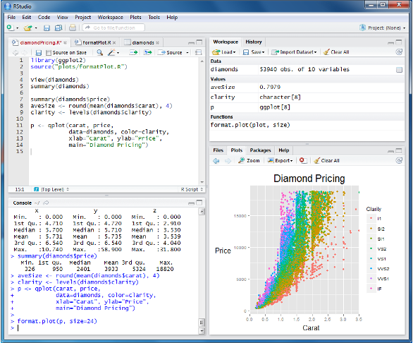

## Welcome

This workshop has one goal: get you comfortable enough in R and tidyverse
that a data frame stops feeling like a wall of numbers and starts feeling
like a tool you can shape. This is a two-hour, hands-on session — this document
mirrors that arc, so you can run every chunk yourself as you go.

Think of today like learning to cook in a new kitchen. Base R is the kitchen
itself — the stove, the knives, the basic physics of heat and cutting. The
**tidyverse** is a really well-organized set of recipes and tools that all
follow the same conventions, so once you learn one, the rest feel familiar.

We'll use the built-in `starwars` dataset throughout, since it's small,
a little goofy, and has exactly the kind of messy real-world quirks (missing
values, mixed types) that real biological data has too.

### Basic Setup for this workshop
```{r}
#| eval: false
# run this once — you don't need to repeat it every session
install.packages("tidyverse")
```

```{r}
#| label: setup
library(tidyverse)
data("starwars")
```


## The R programming language

R is a free, open-source programming language and environment built for
statistical computing and graphics. It was created in the early 1990s by
Ross Ihaka and Robert Gentleman at the University of Auckland, and today it's
maintained by the R Core Team alongside a massive global community of
contributors. Unlike general-purpose languages that treat data as an
afterthought, R was designed around it from day one — vectors, matrices,
data frames, and lists are native, first-class citizens, not add-ons. That's
part of why it maps so naturally onto biological data: a data frame in R
feels a lot like a table of samples, genes, or reads because that's exactly
what it was built to represent.

On top of this core, R is extensible through more than 20,000 packages on
CRAN (the Comprehensive R Archive Network) — including staples like the
**tidyverse**, **ggplot2**, and **caret** — and it runs identically on
Windows, macOS, and Linux, most commonly paired with the RStudio IDE (which
we're using right now).

### Why R has stuck around in data science

| Strength | What it means in practice |
|---|---|
| **Specialized for data science** | Built specifically for statistical computing and analysis, so it handles complex data problems — messy, high-dimensional, biological data included — without fighting the language. |
| **Rich package ecosystem** | 20,000+ CRAN packages cover almost any data task: machine learning, bioinformatics (Bioconductor sits alongside CRAN for this), finance, NLP, geospatial analysis, and more. |
| **Advanced data visualization** | `ggplot2`, `lattice`, and `Shiny` produce clear, interactive, publication-quality graphics — the kind you can drop straight into a manuscript or a dashboard. |
| **Strong community support** | A vibrant, growing community contributes documentation, tutorials, and libraries, with active help available on Stack Overflow and Posit Community. |
| **Reproducibility** | R Markdown and Quarto (like the very document you're reading) make analyses fully reproducible and shareable as HTML, PDF, Word, or interactive dashboards. |
| **Interoperability** | R integrates with Python, SQL, and Spark, so it slots into a broader data pipeline rather than demanding you rebuild everything inside it. |
| **Cross-platform compatibility** | Runs seamlessly on Windows, macOS, and Linux. |
| **Free and open source** | No licensing costs — ideal for individual researchers, startups, and educational institutions alike. |

### R vs Python
The two languages overlap heavily in data science but come from different roots, which still shows up in where each one shines:

| Feature | R | Python |
|---|---|---|
| **Purpose** | Built for statistical modeling, academic research, and data visualization. | General-purpose language excelling in data science, ML, and app development. |
| **Statistical analysis** | Superior stats functions; growing ML support via `caret`, `mlr`. | Strong ML ecosystem — `scikit-learn`, `TensorFlow`, `Keras`; good but less native stats. |
| **Community & support** | Strong in academia and research sectors. | Very large, active, and diverse developer community. |
| **Performance, integration & deployment** | Great for statistical workloads; primarily local analysis. | Better for scalable systems; easily integrates with apps and APIs. |
| **Data handling** | Advanced data frames and manipulation with `dplyr`, `tidyr`. | Comparable support via `pandas` and `NumPy`. |

In practice, this isn't really an R-vs-Python contest — most working bioinformaticians end up fluent in both, reaching for R when the question is statistical (differential expression, hypothesis testing, publication-quality plots) and Python when the task calls for scale, pipelines, or integration with broader software systems.

::: {.callout-tip}
## RStudio orientation
If this is your first time in RStudio: the **Console** (bottom-left) is where
code actually runs and prints output. The **Environment** pane (top-right)
lists every object you've created — like a shelf where R keeps everything
you've made so far. The **Source** pane (top-left) is this document.
:::


## Just Enough Base R to Survive

### Objects and assignment

In R, you store a value in a named box using `<-`. Once it's stored, you can
reuse it anywhere.

```{r}
x <- 5
my_favorite_number <- 5
greeting <- "Hello world!"

print(my_favorite_number)
print(greeting)
```

R is case-sensitive, so `score` and `Score` are two completely different
boxes — a common source of "why isn't this working" bugs.

### Data types

Every value in R has a type, and the type determines what you're *allowed* to
do with it — the same way you can't divide a word by a number. R has a
handful of basic types you'll run into constantly:

- **Numeric** — numbers, with or without decimals (`3.14`, `100`)
- **Character** — text/strings (`"hello"`, `"North Carolina"`)
- **Logical** — `TRUE` or `FALSE` values
- **Integer** — whole numbers only, marked with a trailing `L` (`1L`, `42L`)
- **Factor** — categorical data with a defined, ordered set of levels
  (e.g., `"Low"`, `"Medium"`, `"High"`)
- **NA** — a missing or undefined value; R handles these natively, which
  turns out to be a very big deal once you're working with real data

```{r}
my_age <- 30
pi_approx <- 3.14159

my_name <- "Obi-Wan Kenobi"
my_species <- "Human"

is_jedi <- TRUE
is_sith <- FALSE

lightsaber_count <- 2L   # the trailing L marks this explicitly as an integer

pain_level <- factor("High", levels = c("Low", "Medium", "High"))

unknown_height <- NA     # missing — R won't silently guess a value here

class(my_age)          # "numeric"
class(my_name)          # "character"
class(is_jedi)          # "logical"
class(lightsaber_count) # "integer"
class(pain_level)       # "factor"
class(unknown_height)   # "logical" — NA's default type, but it adapts to context
```

```{r}
my_age + 10          # works fine — numeric supports math
# my_name + 10       # would error — you can't add 10 to text
```

Two things worth flagging early. First, most numbers you type (like `30`)
are stored as `numeric` (technically "double") even without a decimal —
you only get a true `integer` by adding the `L`. Second, a `factor` looks
like text but isn't: it has a fixed set of allowed levels, which matters a
lot for things like ordering plots or building statistical models where
"Low < Medium < High" needs to mean something.


### Data structures

R gives you a handful of ways to organize values together, each suited to a
different shape of problem.

#### Vector — the fundamental unit of R

A vector is a sequence of values of the *same* type — think of it as a
single column in a spreadsheet, isolated and held up to the light.

```{r}
heights <- c(172, 167, 96, 202, 150)
names_vec <- c("Luke", "Leia", "R2-D2", "Darth Vader", "Yoda")
is_human <- c(TRUE, TRUE, FALSE, TRUE, FALSE)

names(heights) <- names_vec
heights
```

Math on a numeric vector applies to every element at once — no loop needed:

```{r}
heights / 100            # convert cm to meters
heights - mean(heights)  # how far is each from the average?
length(heights)
```

#### Matrix — a 2D grid, one type throughout

A matrix is a vector reshaped into rows and columns — still a single type
throughout, but now arranged in two dimensions. You'll see these mostly in
math- and stats-heavy operations (e.g., distance matrices, count matrices).

```{r}
m <- matrix(1:6, nrow = 2, ncol = 3)
m
dim(m)
m[1, ]   # first row
m[, 2]   # second column
```

#### List — the flexible catch-all

A list can hold *anything* — different types, different lengths, even other
lists nested inside it. It's the closest thing R has to a general-purpose
container.

```{r}
character_profile <- list(
  name = "Yoda",
  height_cm = 66,
  is_jedi = TRUE,
  aliases = c("Master Yoda", "Grand Master")
)

character_profile$name
character_profile$aliases
str(character_profile)   # str() gives you a quick peek at any structure
```

#### Data frame — the workhorse of R

A data frame is a table: rows are observations, columns are variables, and —
importantly — each column is itself a vector, which is why the data types
above matter so much. It's the structure you'll spend most of your time in.

```{r}
mini_df <- data.frame(
  name = c("Luke", "Leia", "Yoda"),
  height = c(172, 150, 66),
  is_jedi = c(TRUE, FALSE, TRUE)
)
mini_df
class(mini_df)
```

#### Tibble — a modern, tidyverse-flavored data frame

A tibble is a data frame with some rough edges filed off: cleaner printing,
no silent type conversions, and no partial-name matching surprises. Anything
that expects a data frame will happily accept a tibble too — `starwars`,
which we'll use for the rest of this workshop, is actually loaded as one.

```{r}
mini_tibble <- as_tibble(mini_df)
mini_tibble
class(mini_tibble)
class(starwars)
```


### Objects vs. functions

> "Everything that exists is an object. Everything that happens is a function."

Objects sit there holding a value. Functions *do* something — the parentheses
are the giveaway: if it has `()`, it's a function taking an input and handing
something back, like a vending machine: you put something in, it does its
thing, and something comes out.

```{r}
my_number <- 42
my_vector <- c(1, 2, 3, 4, 5)

sqrt(my_number)     # number in, number out
sum(my_vector)
length(my_vector)
toupper(greeting)

square_root <- sqrt(my_number)  # save the vending machine's output
square_root
```

This is exactly what happens when you load data: `read_csv()` is a function —
you hand it a file path, it hands back a data frame. `starwars` is an object
already sitting in your environment.

### What is a package?

Base R ships with a solid set of built-in functions, but it doesn't try to
do everything out of the box — that's what packages are for. A **package**
is a bundle of functions, data, and documentation that someone else has
written and shared, so you don't have to reinvent it yourself.

You install a package once per machine, and load it once per session:

```{r}
#| eval: false
install.packages("tidyverse")  # download & install — do this once
```

```{r}
library(tidyverse)   # load it into this session — do this every time you restart R
```

Think of `install.packages()` as buying a cookbook and putting it on your
shelf, and `library()` as actually opening it up on the counter before you
start cooking — you only need to buy it once, but you do need to open it
every time you want to use its recipes. The **tidyverse** you're using
throughout this workshop isn't a single package at all — it's a collection
of packages (`dplyr`, `ggplot2`, `tidyr`, `readr`, and others) that all
share the same design philosophy, which is exactly why `filter()`, `mutate()`,
and `ggplot()` all feel like they belong to the same language.

## A First Look at a Data Frame

A data frame is a table: rows are observations, columns are variables, and
each column is itself a vector — which is why data types matter so much.

```{r}
nrow(starwars)
ncol(starwars)
dim(starwars)
glimpse(starwars)
```

```{r}
head(starwars)
```

Pull out a single column with `$` — this hands you back a plain vector:

```{r}
mean(starwars$height, na.rm = TRUE)
max(starwars$height, na.rm = TRUE)
min(starwars$height, na.rm = TRUE)
```

`na.rm` is worth pausing on. R is strict: if there's a missing value (`NA`)
anywhere and you don't explicitly say what to do about it, R refuses to
guess and just hands back `NA` for the whole calculation.

```{r}
mean(starwars$height)                # NA — R won't guess past a gap
mean(starwars$height, na.rm = TRUE)  # tells R to skip the gaps
```

## The dplyr Core Five

`dplyr` gives you five verbs that cover almost everything you'll do to a data
frame. Each one takes a data frame in and hands a data frame back — like
stations on an assembly line, each doing exactly one job.

Before that, meet the pipe, `%>%` — read it as **"and then."** It takes
whatever's on the left and feeds it into the function on the right, so you
can read a chain of steps top to bottom like a recipe instead of nesting
parentheses inside parentheses.

```{r}
# these two lines do the same thing:
summary(starwars)
starwars %>% summary()
```

::: {.callout-note}
Keyboard shortcut for `%>%`: **Cmd/Ctrl + Shift + M**. R also has a native
pipe, `|>` — either works, we'll stick to `%>%` today for consistency.
:::

### `filter()` — keep rows that match a condition

```{r}
humans <- starwars %>% filter(species == "Human")
nrow(humans)
```

```{r}
# , between conditions means AND
tall_humans <- starwars %>% filter(species == "Human", height > 180)

# | means OR
humans_or_droids <- starwars %>% filter(species == "Human" | species == "Droid")

# shortcut for "matches any of these values"
humans_or_droids <- starwars %>% filter(species %in% c("Human", "Droid"))

# !is.na() reads as "is NOT missing"
no_missing_height <- starwars %>% filter(!is.na(height))
```

### `select()` — keep the columns you want

```{r}
starwars %>% select(name, height, species)
```

```{r}
starwars %>% select(-films, -vehicles, -starships)   # drop with -
starwars %>% select(name:eye_color)                   # a range of columns
starwars %>% select(starts_with("s"))                 # pattern match
```

Chain `filter()` and `select()` together — "give me the name and height of
every human":

```{r}
starwars %>%
  filter(species == "Human") %>%
  select(name, height)
```

### `mutate()` — create or modify a column

```{r}
starwars %>%
  mutate(height_m = height / 100) %>%
  select(name, height, height_m)
```

```{r}
starwars %>%
  mutate(
    height_m = height / 100,
    bmi = mass / height_m^2
  ) %>%
  select(name, height_m, mass, bmi)
```

`if_else()` handles two outcomes; `case_when()` is the version for more than
two — read it as **"when THIS is true, give me THAT."**

```{r}
starwars %>%
  mutate(is_tall = if_else(height > 180, "tall", "not tall")) %>%
  select(name, height, is_tall)
```

```{r}
starwars %>%
  mutate(height_category = case_when(
    height < 100                  ~ "short",
    height >= 100 & height < 180  ~ "average",
    height >= 180                 ~ "tall",
    is.na(height)                 ~ "unknown"
  )) %>%
  select(name, height, height_category)
```

### `arrange()` — sort rows

```{r}
starwars %>% arrange(height) %>% select(name, height)              # ascending
starwars %>% arrange(desc(height)) %>% select(name, height)        # descending
starwars %>% arrange(species, desc(height)) %>% select(name, species, height)
```

### `summarize()` — collapse rows to a single summary

```{r}
starwars %>% summarize(mean_height = mean(height, na.rm = TRUE))
```

```{r}
starwars %>%
  summarize(
    mean_height   = mean(height, na.rm = TRUE),
    median_height = median(height, na.rm = TRUE),
    min_height    = min(height, na.rm = TRUE),
    max_height    = max(height, na.rm = TRUE),
    n             = n()   # n() counts rows
  )
```

## Group Operations

`group_by()` + `summarize()` is where dplyr starts to feel powerful: it
splits the data frame into invisible sub-tables — one per group — runs your
summary on each separately, and stitches the results back into one table.

```{r}
starwars %>%
  group_by(species) %>%
  summarize(
    mean_height = mean(height, na.rm = TRUE),
    n = n()
  )
```

Chain more steps in: filter first, group, summarize, then filter the
*result* of the summary too.

```{r}
starwars %>%
  filter(!is.na(species)) %>%
  group_by(species) %>%
  summarize(
    mean_height = mean(height, na.rm = TRUE),
    mean_mass   = mean(mass, na.rm = TRUE),
    n = n()
  ) %>%
  filter(n > 2) %>%
  arrange(desc(mean_height))
```

`count()` is shorthand for `group_by() %>% summarize(n = n())`:

```{r}
starwars %>% count(species, sort = TRUE)
starwars %>% count(species, gender, sort = TRUE)
```


## First ggplot

`ggplot2` builds a plot in layers, like clear plastic sheets stacked on an
overhead projector: one layer sets up the axes, the next adds the shapes,
the next adds color, and so on. The grammar is always
`ggplot(data, aes(x, y)) + geom_*()` — `aes()` maps columns to visual
properties, `geom_*()` decides what shape represents them.

### Bar chart from a summary

```{r}
species_counts <- starwars %>%
  count(species, sort = TRUE) %>%
  filter(n > 1)

ggplot(species_counts, aes(x = n, y = reorder(species, n))) +
  geom_col(fill = "steelblue") +
  labs(
    title = "Number of characters per species",
    x = "Count",
    y = "Species"
  )
```

### Scatter plot

```{r}
starwars %>%
  filter(mass > 1000) %>%
  select(name, height, mass, species)   # spot the outlier
```

Jabba the Hutt is throwing off the scale — worth removing for a cleaner view:

```{r}
starwars %>%
  filter(mass < 1000, !is.na(gender)) %>%
  ggplot(aes(x = height, y = mass, color = gender)) +
  geom_point(size = 3, alpha = 0.7) +
  geom_smooth(method = "lm", se = FALSE) +
  labs(
    title = "Height vs mass in Star Wars characters",
    x = "Height (cm)",
    y = "Mass (kg)",
    color = "Gender"
  )
```

### Choosing a geom

The geom you reach for depends on the shape of the question:

- `geom_col()` / `geom_bar()` — counts or values per category
- `geom_point()` — relationship between two numeric variables
- `geom_line()` — trends over time or an ordered sequence
- `geom_boxplot()` — distribution of a numeric variable per group
- `geom_histogram()` — distribution of a single numeric variable

```{r}
starwars %>%
  filter(!is.na(gender)) %>%
  ggplot(aes(x = gender, y = height, fill = gender)) +
  geom_boxplot() +
  labs(title = "Height distribution by gender")
```

```{r}
starwars %>%
  filter(!is.na(height)) %>%
  ggplot(aes(x = height)) +
  geom_histogram(bins = 20, fill = "steelblue", color = "white") +
  labs(title = "Distribution of character heights")
```

### The full pattern

This is the shape you'll write constantly, in bioinformatics as much as
anywhere else: **start with data, clean it, group it, summarize it, plot
it.**

```{r}
starwars %>%
  filter(!is.na(height)) %>%
  group_by(species) %>%
  summarize(mean_height = mean(height), n = n()) %>%
  filter(n > 2) %>%
  ggplot(aes(x = reorder(species, mean_height), y = mean_height)) +
  geom_col(fill = "steelblue") +
  coord_flip() +
  labs(
    title = "Mean height by species (species with >2 characters)",
    x = "Species",
    y = "Mean height (cm)"
  )
```


## Cleaning Quiz

Match each request to the dplyr verb that does the job. Try it yourself
before expanding the answer.

::: {.callout-note collapse="true"}
## 1. "I only want to look at characters from Tatooine"
`filter()` — you're keeping a subset of *rows* based on a condition.

```{r}
starwars %>% filter(homeworld == "Tatooine")
```
:::

::: {.callout-note collapse="true"}
## 2. "I want to keep only the name and height columns"
`select()` — you're keeping a subset of *columns*.

```{r}
starwars %>% select(name, height)
```
:::

::: {.callout-note collapse="true"}
## 3. "I want to add a BMI column using height and mass"
`mutate()` — you're creating a new column from existing ones.

```{r}
starwars %>%
  mutate(bmi = mass / (height / 100)^2) %>%
  select(name, bmi)
```
:::

::: {.callout-note collapse="true"}
## 4. "I want to see the tallest characters first"
`arrange()` — you're reordering rows, descending on `height`.

```{r}
starwars %>% arrange(desc(height)) %>% select(name, height)
```
:::

::: {.callout-note collapse="true"}
## 5. "I want to know the average height across all characters"
`summarize()` — you're collapsing many rows into one number.

```{r}
starwars %>% summarize(mean_height = mean(height, na.rm = TRUE))
```
:::

## Practice: A TidyTuesday-Style Warm-Up

[#TidyTuesday](https://github.com/rfordatascience/tidytuesday) is a weekly
community project: one new public dataset dropped every week, purely for
practicing exactly what you learned this morning. Today's practice set uses
results from the Milano 2026 Winter Olympics.

```{r}
#| eval: false
dataset_url <- "https://raw.githubusercontent.com/chendaniely/olympics-2026/refs/heads/main/data/final/olympics/olympics_events.csv"
df <- readr::read_csv(dataset_url)

summary(df)
```

Try answering these using only `filter()`, `select()`, `group_by()`,
`summarize()`, `count()`, and `ggplot()` — no new functions required:

1. How many events of each sport awarded a medal?
2. Which venue hosted the most events?
3. Which day had the most events overall?

```{r}
#| eval: false
# starter scaffold — fill in the blanks
df %>%
  group_by(discipline_name) %>%
  summarize(n = n()) %>%
  ggplot(aes(x = reorder(discipline_name, n), y = n)) +
  geom_col()
```

::: {.callout-tip}
If you finish early, the same #TidyTuesday project has dozens of other
approachable datasets — Simpsons episodes, Pokémon stats, British Library
funding — all loadable with `tidytuesdayR::tt_load()`. Good weekend practice
once today's material has settled.
:::

## Resources

- Learn R interactively, inside R: <https://swirlstats.com/>
- Learn tidyverse: <https://tidyverse.org/learn/> and
  <https://jhudatascience.org/tidyversecourse/intro.html>
- dplyr cheatsheet: <https://nyu-cdsc.github.io/learningr/assets/data-transformation.pdf>
- Data visualization deep-dive: <https://r4ds.had.co.nz/data-visualisation.html>
- A good general data-science-writing read: <https://pudding.cool/>

