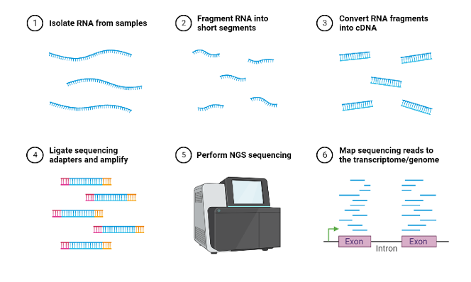
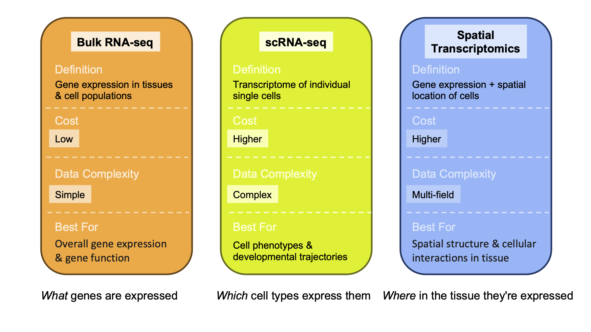
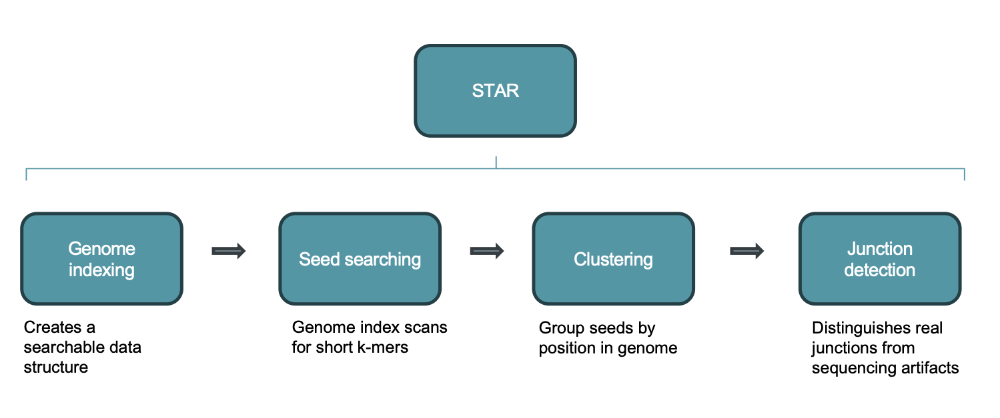
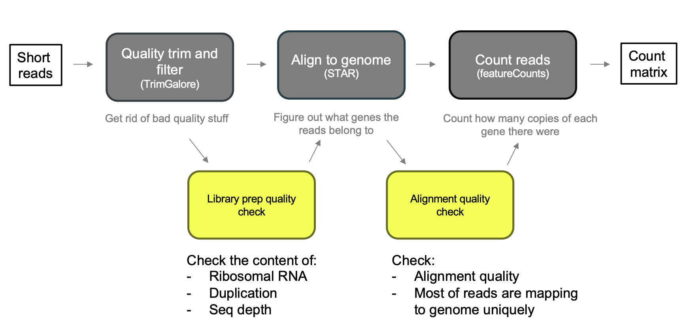
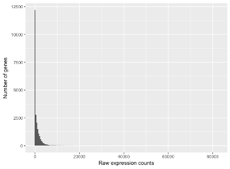

## Introduction: What Is RNA-seq?

RNA sequencing (RNA-seq) is a high-throughput, next-generation sequencing (NGS)
technology used to analyze the entire transcriptome — every RNA molecule — in
a cell or group of cells at a specific moment in time. The basic recipe is
always the same: isolate RNA, convert it to complementary DNA (cDNA), and
sequence it. What comes out the other end lets you identify, quantify, and
analyze gene expression across whatever samples you're comparing.



That single technology, though, can be pointed at very different questions
depending on how you set up the experiment. This document walks through the
one of the major flavors of RNA-seq experiment: bulk RNA-seq  (vs. single-cell, and spatial trancriptomics),the bioinformatics workflow that turns raw sequencing reads into a usable count matrix, the statistics and R script behind differential expression analysis, and how those counts can be extended into gene co-expression networks.

## Three Ways to Ask Transcriptomic Questions

::: {.panel-tabset}

### Bulk RNA-seq

Bulk RNA-seq is the workhorse approach: RNA is extracted from a tissue or a
population of cells all at once, so the resulting measurements are an
*average* across every cell in the sample. It's the right tool when the
questions are about groups rather than individual cells:

- How many and which genes are differentially expressed — up- or
  down-regulated between conditions?
- What are the absolute expression levels — which genes are effectively "on"
  versus "off"?
- What biological pathways are affected (the functional interpretation of
  those expression changes)?
- How do samples compare — disease versus healthy, treated versus control,
  and so on?
- Can outcomes be predicted from expression patterns (biomarkers,
  classification)?

The catch is exactly what makes it efficient: because it averages across
every cell in the sample, it can hide important structure. A tumor sample,
for instance, contains cancer cells, immune cells, stromal cells, and
endothelial cells all mixed together, and a bulk measurement blends all of
them into one number per gene. A study comparing peripheral blood mononuclear
cells (PBMCs) from dogs with different mammary tumor types illustrates this
directly: cells from tumor-impaired animals showed a large number of
down-regulated genes relative to normal and normal-like samples — a
population-level signal that bulk sequencing is well suited to detect.

### Single-cell RNA-seq (scRNA-seq)

Single-cell RNA-seq is a higher-resolution technology that measures gene
expression in individual cells rather than averaging across a bulk sample. By
isolating individual cells and sequencing their unique mRNA, researchers can
identify distinct cell types, reveal heterogeneity that would otherwise be
invisible, and track disease progression or developmental change cell by
cell. Where bulk RNA-seq answers questions about groups, scRNA-seq answers
questions about composition and identity:

- What cell types are present (cell identity and clustering)?
- What is the developmental trajectory — how do cell states transition over
  something like pseudotime?
- Which genes distinguish one cell type from another (marker genes per
  cluster)?
- What does the cell-cell interaction network look like (ligand-receptor
  pairs)?
- How heterogeneous is expression from cell to cell?
- Are there rare cell populations that a bulk measurement would have averaged
  away entirely?

A useful real-world illustration comes from work characterizing circulating
leukocytes in dogs: unsupervised clustering of tens of thousands of cells
revealed 42 distinct immune cell populations in healthy animals. Extending
that same approach to dogs with osteosarcoma showed that myeloid cells
contributed to most of the transcriptomic changes between healthy and cancer
samples, while double-negative T cells and B cells shifted in relative
abundance — the kind of population-specific detail that a bulk measurement
of the same tissue would have blurred into a single averaged signal.

### Spatial transcriptomics

Spatial transcriptomics is a molecular profiling method that maps gene
expression directly within intact tissue samples, preserving the physical
location of each cell. By combining imaging with next-generation sequencing,
it reveals not just which genes are active, but *where* in the tissue they
are active — crucial context for understanding cellular interactions and
structures like the tumor microenvironment. Its natural questions are
inherently spatial:

- Where in a tissue (in two or three dimensions) are particular genes
  expressed?
- What is the spatial organization of different cell types — the tissue's
  architecture?
- How do neighboring cells interact, based on their physical proximity?
- What disease-associated spatial patterns exist — lesions, infiltration,
  zonation?
- How does expression vary by tissue region (microdomain biology)?
- What is the tissue's structural or layer composition, combining
  histological context with transcriptomic data?

Tumor biology is a natural fit for this approach: spatial transcriptomics can
reveal intratumoral subpopulations and spatial clustering patterns tied to
gene expression across primary, metastatic, and recurrent tumors, letting
researchers investigate intratumoral complexity and the surrounding tumor
environment in ways that neither bulk nor single-cell sequencing can, since
both of those methods discard spatial position during sample processing.

:::

### Comparing the three approaches



In one line: bulk RNA-seq tells you *what* genes are expressed, single-cell
RNA-seq tells you *which cell types* express them, and spatial
transcriptomics tells you *where* in the tissue they're expressed.


## Bioinformatics in Bulk RNA-seq

### The workflow at a glance

Once you've decided bulk RNA-seq is the right approach and sequencing is
done, the raw output is a pile of short reads that need to be turned into
something biologically meaningful. The standard workflow has three main
stages, run in order:

1. **Quality trim and filter** (commonly with a tool like TrimGalore) — get
   rid of bad-quality stuff before it contaminates everything downstream.
2. **Align to the genome** (commonly with STAR) — figure out what gene each
   read belongs to.
3. **Count reads** (commonly with featureCounts) — count how many copies of
   each gene's transcript were present, producing a count matrix.


::: {.callout-note title="Vocabulary"}
A few pieces of vocabulary are worth pinning down before going further. A
**read** is the basic unit of sequencing output: a fragment of sequence that
has actually been sequenced. **Depth** (or coverage) is the average number of
reads that map to a given region of the genome or transcriptome — higher
depth means greater sensitivity for detecting lowly expressed genes. The
**count matrix** that comes out at the end has genes as rows and samples as
columns, where each number is how many reads mapped to that gene in that
sample.
:::

::: {.callout-note title="Two caveats"}
First, raw counts are not directly comparable between samples — different
samples can have different total sequencing depth, so counts need to be
normalized before they can be compared meaningfully (more on this below).
Second, and more fundamentally: a bad experimental design cannot be fixed
computationally. Replication, randomization, and controlling for batch
effects all have to happen *before* sequencing — no amount of downstream
statistical cleverness recovers an experiment that wasn't designed properly
in the first place.
:::

### Alignment with STAR

DNA aligners generally fail on RNA-seq data, because RNA reads span introns —
a read can start in one exon and continue in another, with the intervening
intron spliced out. Detecting those exon-exon junctions requires an aligner
built for the job. STAR (Spliced Transcripts Alignment to a Reference) is the
standard tool: it's splicing-aware, handling spliced reads directly, and it's
fast and accurate compared with older, unspliced aligners.



STAR's alignment process breaks down into four stages:

- **Genome indexing** — STAR creates a searchable data structure from the
  reference genome ahead of time, so it doesn't have to scan the raw genome
  sequence for every read.
- **Seed searching** — for every read, STAR searches for the longest
  sequence that exactly matches one or more locations in the reference
  genome. These longest exact matches are called Maximal Mappable Prefixes
  (MMPs), and each one is called a "seed" (the first is seed1). STAR then
  searches again, but only against the *unmapped* portion of the read, to
  find the next MMP (seed2), and so on. This sequential searching of only
  the leftover, unmapped portion of the read — rather than repeatedly
  searching the whole read — is what makes STAR's algorithm efficient. It
  relies on an uncompressed suffix array to search quickly even against very
  large reference genomes, in contrast to slower aligners that search the
  entire read before splitting and iterating.
- **Clustering** — the separate seeds from a single read are stitched back
  together into one complete alignment. STAR first clusters seeds by
  proximity to a set of "anchor" seeds (seeds that don't map to multiple
  locations), then stitches them together based on the best-scoring
  alignment for the read, with scoring based on mismatches, indels, gaps,
  and similar penalties.
- **Junction detection** — STAR distinguishes genuine splice junctions from
  sequencing artifacts, which is what allows it to correctly place reads
  that span an exon-exon boundary rather than an intron.

### Quality checks along the way

Quality control happens at two points in the workflow: a library-prep quality
check (on the raw and trimmed reads) and an alignment quality check (once
reads have been mapped). At the alignment stage, the two things to watch are
whether alignment quality is generally good — that is, whether most reads are
mapping to the genome uniquely — and the content of the reads themselves:
ribosomal RNA contamination, duplication levels, and sequencing depth.



**Trimming red flags.** Not all reads coming off the sequencer are
trustworthy, and a few patterns are worth specifically watching for after
trimming. Very short reads that remain after trimming are uninformative.
Adapter sequences — synthetic sequences added during library preparation —
are not biological signal and shouldn't be mistaken for it. Low-quality
bases tend to accumulate at the ends of reads simply because the sequencing
chemistry degrades over the course of a run. Keeping low-quality reads
introduces errors downstream: a misread base can cause a read to map to the
wrong gene, or fail to map at all, which corrupts the count matrix everything
else depends on.

More specifically, a few thresholds are useful rules of thumb:

::: {.callout-warning title="Trimming red flags" collapse="true"}
- **High adapter content** (more than roughly 10–15% of reads) suggests
  library prep issues or very short insert sizes. A little adapter
  contamination is normal; a lot means something went wrong during library
  construction.
- **Very high duplication rates** (above roughly 50–60%) mean many reads are
  identical copies of the same original molecule, usually from
  over-amplification during PCR. In extreme cases this means you've
  effectively resequenced the same few molecules over and over and have
  little real coverage.
- **Poor per-base sequence quality at read ends** is expected and fixable by
  trimming — but if quality drops early (in the first 20–30 bases) rather
  than just at the tail, that can indicate a problem with the sequencing run
  itself, not just normal chemistry decay.
- **Overrepresented sequences that aren't adapters** could indicate rRNA
  contamination (very common if mRNA enrichment failed), primers, or other
  contaminants. rRNA reads are uninformative for gene expression and simply
  inflate your total read count without adding any gene-level data.
- **Reads trimmed down to very short lengths** (under roughly 20–25 bp)
  suggest the original insert was tiny to begin with — a library prep
  problem that trimming cannot fix after the fact.
- **Low percentage of reads surviving trimming** (below roughly 70–75%)
  means a large fraction of the data was unusable before the analysis even
  began.
:::


**Alignment red flags.** Once reads are aligned, the single most important
metric is the overall mapping rate: reads that don't map anywhere are
invisible to every downstream analysis. As a real example, a set of samples
from a time-course experiment (D0, D7, and D14, three replicates each)
mapped at rates in the low-to-mid 80% range:

::: {.callout-warning title="Alignment red flags" collapse="true"}
- A low overall mapping rate (below roughly 70–75%) commonly points to one of a
few causes: the wrong reference genome or annotation, heavy rRNA or adapter
contamination, RNA degradation, or sequencing a strain that's genomically
divergent from the reference. 
- A very high multimapping rate — reads that map
equally well to many genomic locations — usually reflects repetitive elements
or paralogous gene families (that is, a substantial number of reads mapping
to somewhere between one and ten loci, versus reads mapping to ten or more
loci and being effectively unresolvable). 
- Uneven coverage across a gene
body is another red flag: a 3' bias (reads piling up toward the 3' end of
transcripts) suggests RNA degradation, since RNA degrades from the 5' end
first and leaves the 3' end better represented; a 5' bias instead points to
a problem in library prep chemistry. Either pattern is worth investigating
by looking at individual genes in a genome browser like IGV. 
- A strand-specificity mismatch — where the alignment parameters don't match how
the library was actually prepared (stranded versus unstranded) — causes
reads to be assigned to the wrong gene or discarded outright, so it's worth
confirming the library's strandedness with whoever ran the sequencing before
choosing alignment parameters.
- Inconsistent mapping rates across
samples are a problem in their own right: if one sample maps at 90% and
another at 40%, the two are not comparable, and the low-quality sample may
need to be excluded — which in turn affects statistical power and the
overall experimental design.
:::

### From aligned reads to a count matrix

The final step of the core workflow — counting reads per gene, commonly with
featureCounts — produces the raw counts table that everything downstream is
built on: genes as rows, samples as columns, and each cell holding the number
of reads that mapped to that gene in that sample. This raw counts table is
the deliverable of the entire upstream pipeline, and it's the starting point
for differential expression analysis.


## Differential Expression Analysis

### Why counts need their own statistics

Differential expression means a gene is expressed at a higher (or lower)
level in one condition compared with another, consistently across
replicates. Answering that question rigorously requires the right
statistical model for count data, and RNA-seq counts have a distinctive
shape: they are not normally distributed, and they are over-dispersed —
meaning the variance is greater than the mean: 



Most genes have low counts,a handful of genes (housekeeping genes, ribosomal genes) have very highcounts, and counts are bounded at zero, since you can't have a negative number of reads. That zero boundary forces any spread in the data to go rightward.

**A Poisson distribution** — a natural first guess for count data — has only one
parameter (λ), which forces variance to equal the mean. Because RNA-seq
counts are over-dispersed, a Poisson model systematically underestimates the
real spread in the data, which makes test statistics look more significant
than they really are and inflates false positives. A normal (Gaussian)
distribution doesn't fit either, because counts are discrete, bounded at
zero, and right-skewed, especially for lowly expressed genes — a continuous,
symmetric distribution is a poor match.

The distribution that does fit is the **negative binomial**: a discrete
distribution bounded at zero, with a long right tail and a dispersion
parameter (α) that lets variance grow faster than the mean. Mathematically,
variance is modeled as σ² = μ + αμ², and when α approaches zero the negative
binomial collapses back into a Poisson distribution — so Poisson is really
just a special case of it. Biologically, this can be thought of as a Poisson
process (capturing the technical counting noise from sequencing) where the
underlying rate λ itself varies across samples according to a Gamma
distribution (capturing real biological variability between samples, such as
sample-to-sample stochasticity in transcription).

Two more concepts round out the statistical picture. First, RNA-seq
differential expression testing is inherently a **multiple testing
problem** — a typical analysis tests around 20,000 genes simultaneously, and
at a naive significance threshold of p < 0.05 that means roughly 1,000 false
positives by chance alone. This is why results are reported using
false-discovery-rate (FDR) correction and an adjusted p-value rather than the
raw p-value. Second, effect sizes are reported as **log2 fold change**: using
log base 2 means a doubling of expression is a clean +1, and a halving is a
clean −1, which makes the scale symmetric and easy to interpret in either
direction.

### DESeq2: from counts to a results table

DESeq2 is a widely used tool for differential expression that estimates
variance across genes, shrinks noisy per-gene estimates toward a common
trend, and then tests each gene individually. Starting from the raw count
matrix, it works in three steps:

1. **Size factor estimation** — normalizes each sample for differences in
   sequencing depth, so counts become comparable across samples.
2. **Dispersion estimation** — estimates each gene's dispersion and shrinks
   noisy per-gene estimates toward a fitted trend line, borrowing statistical
   strength across genes.
3. **GLM fitting and Wald test** — fits a negative-binomial generalized
   linear model per gene and tests the log fold change using a Wald test.

The output is a results table with one row per gene and a standard set of
columns: `baseMean` (the average expression level for that gene across
samples), `log2FoldChange` (the effect size), the Wald test statistic and
its raw p-value, and `padj` (the p-value after Benjamini-Hochberg, or BH,
correction for multiple testing).

Crucially, the statistical model DESeq2 fits is driven directly by the
experimental design formula you give it. A simple one-condition, two-group
comparison (say, treated versus untreated) looks like this, with the
specific contrast of interest specified explicitly afterward:

```r
dds <- DESeqDataSetFromMatrix(countData = counts,
    colData = metadata,
    design = ~ condition)

# then specify the contrast you want explicitly:
results(dds, contrast = c("condition", "day7", "day0"))
```

If there's a batch effect to control for, the design formula simply adds it
as another term, so that batch is controlled for while condition is the
factor actually being tested:

```r
dds <- DESeqDataSetFromMatrix(countData = counts,
    colData = metadata,
    design = ~ batch + condition)
```

And if the question is whether a treatment effect depends on genotype —
an interaction effect — the design formula multiplies the two terms
together:

```r
dds <- DESeqDataSetFromMatrix(countData = counts,
    colData = metadata,
    design = ~ genotype * treatment)
```

### Worked example: a time-course dataset

A concrete example ties all of this together. Consider a dataset with nine
samples: three time points (day 0, day 7, and day 14), three biological
replicates per day. The analysis proceeds through the same general shape
every time: load and clean the data, run DESeq2 to identify differentially
expressed genes (DEGs), and then visualize the results. The questions driving
the analysis are ones like: do we see differences in gene expression over
time, and are those time trends consistent across animals? How many genes
are expressed differently, and which specific genes are they?

### Reading MA plots

An MA plot shows the relationship between expression level and fold change
for every gene simultaneously, which makes it a useful first diagnostic
after running DESeq2. The x-axis (A) is mean expression level, so genes
further to the right are more highly expressed overall. The y-axis (M) is
log2 fold change, with points above zero up-regulated and points below zero
down-regulated; each dot represents one gene. Genes highlighted (commonly in
blue) are the statistically significant DEGs, typically at the default
threshold of padj < 0.1.

When reading an MA plot, the grey cloud of non-significant points should be
centered around M = 0, since most genes shouldn't change between conditions.
If the whole cloud is shifted noticeably up or down, that's a sign of a
possible normalization issue rather than a real biological effect.
Low-expression genes, toward the left of the plot, naturally show more
vertical scatter — that's expected, since fold-change estimates are noisier
when there are fewer counts to base them on.

### Reading volcano plots

A volcano plot shows which individual genes changed the most, both in
magnitude and in statistical confidence, between two conditions. The x-axis
is log2 fold change (how large the change is), and the y-axis is −log10 of
the adjusted p-value (how statistically confident that change is); each dot
is again one gene. Genes in the upper right are significantly up-regulated,
genes in the upper left are significantly down-regulated, and points near the
bottom or center are either not significant or have too small an effect size
to matter. The further a gene sits from the center and the higher up it
appears, the more biologically and statistically meaningful its change is
likely to be. Typical thresholds used to call a gene significant are an
absolute log2 fold change greater than 1 (at least a two-fold change) and an
FDR-corrected adjusted p-value below 0.05.

### Reading heatmaps

A heatmap shows expression patterns across many genes and samples at once,
which makes it well suited for spotting clusters of co-regulated genes. Rows
are individual genes (commonly the top 50 differentially expressed genes),
and columns are individual samples, typically grouped by timepoint. Color
represents scaled, VST-normalized expression level, with red indicating high
expression, blue indicating low expression, and yellow or white indicating
near-average expression. A dendrogram — the tree structure alongside the
heatmap — clusters samples and genes by similarity in their expression
patterns; branches that join lower down (earlier) indicate genes or samples
that are more similar to one another.

In the worked time-course example, the day-0 samples cluster together and
show a distinct expression profile from day 7 and day 14. One large block of
genes is highly expressed at day 0 and then down-regulated by day 7 and day
14; a second block shows the opposite pattern, starting low at day 0 and
rising by day 7 and day 14. Together, that pattern suggests a coordinated
transcriptional shift occurring between day 0 and day 7. In that particular
dataset, genes strongly up-regulated at day 0 included KLHDC8B, ABCA7, NOXA1,
and FASTK, while genes strongly up-regulated at day 7 and day 14 included
SLC2A2, TACC1, APOB, and SLC16A10.

### Ideas for further practice

Once the core DESeq2 workflow and its plots feel familiar, there's a natural
progression of follow-up exercises worth trying on your own data. On the
easier end: change the fold-change threshold used in a volcano plot (say,
from 1 to 0.5 or to 2) and note how the number of called DEGs shifts; change
the number of genes shown in a heatmap (from 50 to 25 or 100) and ask whether
the biological story changes; tighten the significance cutoff from padj <
0.05 to padj < 0.01 and see how many genes are lost; or label the top ten
most significant genes directly on a volcano plot. At a medium level: count
exactly how many genes are up, down, or not significant in each contrast and
present it as a table; filter to only the significant DEGs and save them out
for further work; add an additional contrast (say, day 14 versus day 7) to
see what's still changing between two later time points; or color a PCA plot
by a variable like replicate number to check for batch effects. For a
harder extension: look up what the top DEGs actually are and consider
whether they make biological sense for the experiment; build separate
heatmaps for time-point-specific DEGs rather than pooling contrasts together
and compare the patterns; or apply shrinkage to the fold-change estimates and
compare the MA plot before and after, considering why shrinkage matters.

## Gene Co-expression Networks

### Network basics: nodes and edges

Networks encode the interactions between the components of a complex system,
and the same basic language is used to describe them regardless of the
domain. Every network is made of **nodes** (the individual components) and
**edges** (the connections between them). This vocabulary shows up across
disciplines — from food-web ecology, where nodes represent organisms and
edges represent trophic or competitive interactions, to gene co-expression,
where nodes represent genes and edges represent statistical relationships
between them.

### Random vs. scale-free networks

Not all networks share the same underlying structure, and the structure
matters for how a network behaves. In a **random network**, every node has
roughly the same number of connections, but those connections are
distributed randomly; such networks tend to have low average distance
between nodes and low clustering. In a **scale-free network**, by contrast,
a small number of nodes have many more connections than average (hubs),
while most nodes have relatively few; scale-free networks show medium-low
distance between nodes but higher clustering, a combination often described
as "small-world" structure. The degree distribution — how many nodes have a
given number of connections — differs sharply between the two: random
networks have a fairly narrow, bell-shaped degree distribution, while
scale-free networks follow a power-law distribution, with most nodes having
very few connections and a small number of highly connected hubs.

### Co-expression networks: the concept and its pitfalls

A **co-expression network** applied to RNA-seq data uses genes as nodes and
the correlation between their counts as edges. The core intuition is that
genes which are consistently co-expressed are likely regulated by the same
transcription factors, involved in the same pathways, or otherwise
functionally related. By grouping correlated genes into modules, thousands
of individual genes can be summarized into a handful of coherent patterns,
and those patterns can then be tested for association with the experimental
conditions of interest.

Building a co-expression network naively, however, has some real pitfalls.
Using a hard correlation threshold (say, keeping only pairs with r > 0.8)
throws away information arbitrarily: a correlation of 0.79 gets discarded
entirely while 0.81 is kept in full, even though the two are practically
indistinguishable. A hard threshold also fails to reflect the scale-free
topology that real biological networks tend to have, and it's vulnerable to
background noise producing false-positive edges.

### WGCNA: Weighted Gene Co-expression Network Analysis

Weighted Gene Co-expression Network Analysis (WGCNA) addresses those
pitfalls directly. Rather than a single hard cutoff, it identifies clusters
of genes — called **modules** — that share correlated expression patterns,
and then explores how those modules relate to one another and to the
experimental variables of interest. The core idea is the same as for any
co-expression approach: genes with correlated expression across samples are
likely to be co-regulated or functionally related. Each module is given a
color name (MEblue, MEturquoise, and so on) purely as a label. Within a
module, the most highly connected gene is called the **hub gene**, and hub
genes are often the most biologically meaningful members of their module. A
WGCNA network is visualized the same way any network is: nodes are genes,
and edges represent the strength of correlation between them. As one
real-world example, a WGCNA analysis can turn up a module enriched for
immune-related genes whose overall activity correlates with disease
severity.

### The WGCNA workflow, step by step

WGCNA proceeds through a series of steps, each building on the last:

- **Step 0.5 — VST normalization.** Before building any network, counts are
  variance-stabilizing-transformed (VST), because the goal is to capture how
  much expression changes, not its absolute magnitude. This step matters for
  two reasons. First, RNA-seq counts are heteroscedastic: highly expressed
  genes naturally show much larger absolute differences between samples than
  lowly expressed genes do, even when their *relative* variation is
  identical, and that distorts a standard Pearson correlation. Second, raw
  counts are right-skewed integers, while correlation assumes data that are
  roughly continuous and symmetric.
- **Step 1 — create a gene co-expression network.** Rather than a hard
  correlation cutoff, WGCNA applies a soft-thresholding power (β) to the
  correlation matrix. At β = 1, the network is effectively using raw
  correlations, so everything stays connected and the network has no real
  structure. At a much higher value, such as β = 12, only very strongly
  correlated genes retain meaningful connection weight, and the network
  becomes sparse and biologically interpretable.
- **Step 2 — identify modules.** Genes are grouped into modules of shared,
  correlated expression, each labeled with its own color name.
- **Step 3 — relate modules to external information.** Each module's overall
  expression pattern is tested for association with experimental traits or
  metadata of interest, connecting the co-expression structure back to the
  biology being studied.
- **Step 4 — study module relationships.** Modules themselves can be related
  to one another, revealing higher-order structure among the co-expression
  patterns.
- **Step 5 — find the key drivers in modules of interest.** Within a module
  that shows an interesting association, the hub genes are identified as
  candidate key drivers of that module's behavior.

## Resources

- Bulk RNA-seq: <https://academic.oup.com/bib/article/22/6/bbab259/6330938>
- Differential expression and RNA-seq data analysis (count modeling):
  <https://hbctraining.github.io/Training-modules/planning_successful_rnaseq/lessons/count_modeling.html>
- STAR alignment walkthrough:
  <https://hbctraining.github.io/Intro-to-rnaseq-hpc-O2/lessons/03_alignment.html>
- Canine PBMC mammary tumor expression study:
  <https://pmc.ncbi.nlm.nih.gov/articles/PMC12256404/>
- Canine leukocyte scRNA-seq (healthy vs. osteosarcoma):
  <https://www.frontiersin.org/journals/immunology/articles/10.3389/fimmu.2023.1162700/full>
- Spatial transcriptomics (Rao et al. 2021, *Nature*):
  <https://www.nature.com/articles/s41586-021-03634-9>
- Spatial transcriptomics in tumor heterogeneity:
  <https://www.nature.com/articles/s42003-026-10152-9>
- Example time-course RNA-seq dataset:
  <https://www.nature.com/articles/s41467-024-48261-w>
- WGCNA introduction and applications:
  <https://bigomics.ch/blog/introduction-to-wgcna-and-its-applications-in-gene-correlation-network-analysis/>
- WGCNA video walkthrough: <https://www.youtube.com/watch?v=q9a2RvqYZzQ>
- WGCNA examples in the veterinary literature:
  <https://www.mdpi.com/2076-2615/14/10/1470>
- Networks in microbial ecology (review):
  <https://journals.asm.org/doi/full/10.1128/mSystems.00124-19>
- Networks background video: <https://www.youtube.com/watch?v=pYMsI-8GsxI>
- Scale-free network background: <http://social-dynamics.org/scale-free-network/>
- Newman on networks (reference reading):
  <https://drive.google.com/file/d/1vuwIeIfuOCN-xcKxeBnubP0Bg9GQG95z/view?ts=63b49e85>
- Nature subjects: ecological networks:
  <https://www.nature.com/subjects/ecological-networks>
